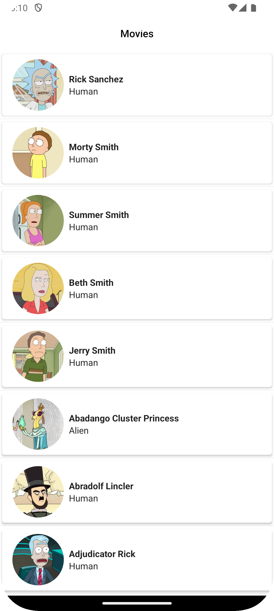
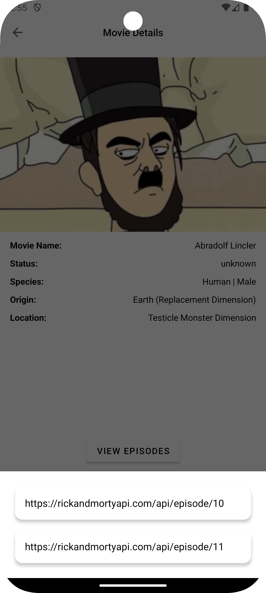

# Pagination-Android

A modern Android application demonstrating Paging (Pagination) using Kotlin, Retrofit, and MVVM architecture.

This project shows how to efficiently load large datasets from a remote API using Android Paging 3, improving performance and user experience.

---

## Features

- Paging 3 implementation for infinite scrolling
- Retrofit for network requests
- MVVM architecture (ViewModel + Repository + PagingSource)
- RecyclerView with efficient data loading
- Cached data using viewModelScope
- Error handling and loading states

---

## Architecture

The project follows MVVM + Repository pattern:

UI (Activity / RecyclerView)
↓
ViewModel
↓
Repository
↓
PagingSource
↓
Retrofit API

---

## Tech Stack

- Kotlin
- Android Paging 3
- Retrofit
- OkHttp Logging Interceptor
- LiveData
- ViewModel
- RecyclerView
- Material Components

---

## Project Structure
```text
package name
│
├── data
│   ├── DataSource (PagingSource)
│   ├── network (Retrofit)
│   └── repository
│
├── domain
│   ├── models
│   └── repositories
│
├── presentation
│   ├── viewModel
│   ├── adapter
│   └── ui (Activity classes)
│
└── MainActivity.kt
```
---

## Screenshot





---

## How It Works

1. App starts and loads first page of data
2. PagingSource requests data from repository
3. Repository fetches data from API (Retrofit)
4. RecyclerView displays data
5. As user scrolls, next pages are loaded automatically
6. Data is cached in ViewModel using cachedIn()

---

## Key Concept

Paging 3 removes the need for manual pagination:

- No "Load More" button
- No manual page tracking
- Automatic data loading on scroll

---

## Setup Instructions

1. Clone the project
   git clone https://github.com/moseskamira/pagination-android.git

2. Open in Android Studio

3. Sync Gradle

4. Run on emulator or device

---

## Requirements

- Android Studio Arctic Fox or newer
- Minimum SDK 24
- Internet connection

---

## Learning Outcomes

- How Paging 3 works internally
- MVVM architecture implementation
- Clean separation of layers
- Efficient large data handling in Android

---

## License

This project is open-source and free to use under MIT License.
